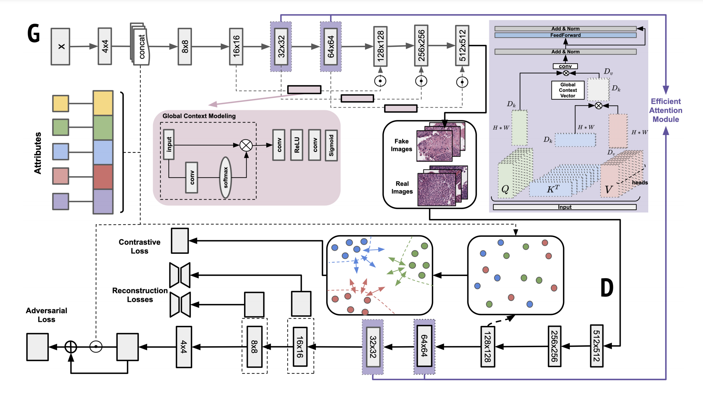

# A Multi-attribute Controllable Generative Model for Histopathology Image Synthesis

This is the pytorch implementation for our MICCAI 2021 paper.

> **A Multi-attribute Controllable Generative Model for Histopathology Image Synthesis**<br>
Jiarong Ye, Yuan Xue, Peter Liu, Richard Zaino, Keith C. Cheng, Xiaolei Huang <br>
> [paper](https://link.springer.com/chapter/10.1007/978-3-030-87237-3_59) (MICCAI 2021 Poster) 
> [video](https://drive.google.com/file/d/16yzgxdz6JIWK3hl8Cp5sKgBl6lvLwJJH/view?usp=sharing)
>
>**Abstract:** Generative models have been applied in the medical imaging domain for various image recognition and synthesis tasks. However, a more controllable and interpretable image synthesis model is still lacking yet necessary for important applications such as assisting in medical training. In this work, we leverage the efficient self-attention and contrastive learning modules and build upon state-of-the-art generative adversarial networks (GANs) to achieve an attribute-aware image synthesis model, termed AttributeGAN, which can generate high-quality histopathology images based on multi-attribute inputs. In comparison to existing single-attribute conditional generative models, our proposed model better reflects input attributes and enables smoother interpolation among attribute values. We conduct experiments on a histopathology dataset containing stained H&E images of urothelial carcinoma and demonstrate the effectiveness of our proposed model via comprehensive quantitative and qualitative comparisons with state-of-the-art models as well as different variants of our model.
>
>**Keywords:** Histopathology image synthesis, Attribute-aware conditional generative model, Conditional contrastive learning 


# Architecture


# Usage
### Environment
* Python >= 3.6
* Pytorch 1.9.1
* CUDA 10.2

### Dependencies:
Install the dependencies:
```
pip install -r requirements.txt
```

### Datasets

Dataset download link: [nmi-wsi-diagnosis](https://figshare.com/projects/nmi-wsi-diagnosis/61973)


# Training

```
python run.py
```

# Visualization 

### Tensorboard monitoring

```
tensorboard --logdir saved_models/histology --port <port-id>
```

### Generate images
Download the pre-trained model to the `pretrain_model` directory: [Google Drive Link](https://drive.google.com/file/d/1U9jRTV7BxxYVxpeQow8Nczb1whRNoIHL/view?usp=sharing)

```
python generate.py
```


# Acknowledgment

- Dataset credit: 
```
@article{zhang2019pathologist,
  title={Pathologist-level interpretable whole-slide cancer diagnosis with deep learning},
  author={Zhang, Zizhao and Chen, Pingjun and McGough, Mason and Xing, Fuyong and Wang, Chunbao and Bui, Marilyn and Xie, Yuanpu and Sapkota, Manish and Cui, Lei and Dhillon, Jasreman and others},
  journal={Nature Machine Intelligence},
  volume={1},
  number={5},
  pages={236--245},
  year={2019},
  publisher={Nature Publishing Group}
}
```

- This repo borrows code from [light-weight GAN](https://github.com/lucidrains/lightweight-gan)

```
@inproceedings{liu2020towards,
  title={Towards Faster and Stabilized GAN Training for High-fidelity Few-shot Image Synthesis},
  author={Liu, Bingchen and Zhu, Yizhe and Song, Kunpeng and Elgammal, Ahmed},
  booktitle={International Conference on Learning Representations},
  year={2020}
}
```

# Citation
If you find our work useful in your research, please cite our paper:
```
@inproceedings{Ye2021AMC,
  title={A Multi-attribute Controllable Generative Model for Histopathology Image Synthesis},
  author={Jiarong Ye and Yuan Xue and Peter Xiaoping Liu and Richard J. Zaino and Keith C. Cheng and Xiaolei Huang},
  booktitle={MICCAI},
  year={2021}
}
```

